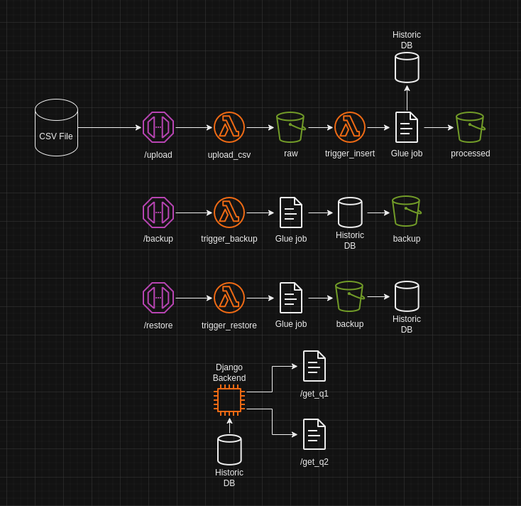

# GCC Cloud
## Infrastructure



This insfrastructure allows the following features:
- POST to `/upload` endpoint that receives as binary-data a CSV file with an `object_name` (`departments`, `jobs` or `hired_employees`). This upload will trigger a lambda function that split the files in blocks of maximum 1000 rows in S3 raw bucket. Each file inserted in S3 will trigger another lambda that start a Glue job with this file to insert the data in a PostgreSQL database. Also data is stored in processed S3 bucket as a backup.
- The data will be "upserted" into the database, replacing older values with the same IDs.
- POST to `/backup` endpoint with an `object` name, that will send this data to a lambda triggering a Glue job. This glue job extract the corresponding object table and store it in backup S3 storage in AVRO format
- POST to `/restore` endpoint with an `object` name and a `run_id`. This will use a lambda function to trigger a Glue job that will extract the table from S3 backup bucket, using the `run_id` as an ID of the table, and upsert it into the database. (is not currently supported the feature to change data in other tables during a restore)

The terraform code does not include:
- EC2 instance with django backend
- RDS database with historic data

## How to upload a file

To upload a file to `raw` S3 bucket, you have to execute a POST request to the API URL in the `/upload` endpoint, using the following curl example:
```
curl --location '<rest_api_url>/dev/upload?object=<object_name>' \
--header 'Content-Type: text/csv' \
--data '<csv_file_location>'
```
Where the `object` can be `departments`, `jobs` or `hired_employees`. This will allow to process the file in their corresponding pipeline to get into the database.
## To Do
- Create a single Cloudwatch group and logs to monitor the pipeline